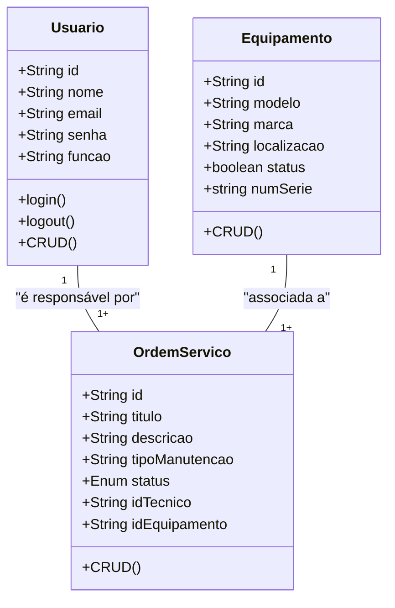
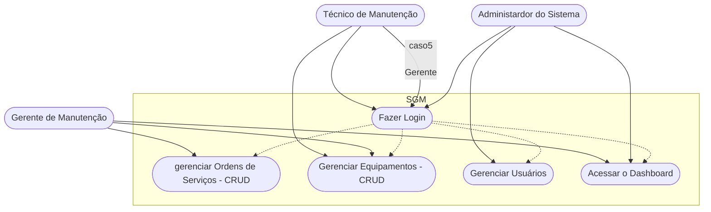

# Sistema de Gestão de Manutenção (SGM) - Formativa

## Briefing
O projeto consiste no desenvolvimento de um Sistema de Gestão de Manutenção (SGM) no formato de uma aplicação web. O objetivo é centralizar e otimizar o controle das atividades de manutenção de máquinas e equipamentos de uma empresa. A plataforma permitirá o cadastro de equipamentos, agendamento de manutenções preventivas e corretivas, e o gerenciamento de ordens de serviço.

## Objetivo do Projeto
- gerenciar informações sobre equipamentos e manutenção realizadas pela empresa
- realizar abertura de chamados de manutenção (ordens de serviço)
- dashboard de históricos de manutenção
- proteger acesso aos dados do sistema (criptografia e autenticação segura de usuários)

## Público-Alvo
- Tecnicos de Manutenção (usuários finais)
- Gestores de Manutenção (usuáriso intermediários)
- Administradores do Sistema (Gerenciar a permissão dos usuários)

## Levantamento de Requistos do Projeto

- ### Requistos Funcionais

- ### Requisitos Não Funcionais

## Recursos do Projeto
- ### Tecnológicos
    - Framework de Desenvolvimento Next/React
    - Linguagem de Programação: TypeScript
    - Banco de Dados: Não Relacional (MongoDB)
    - GitHub
    - VsCode
    - Figma

- ### Pessoal
    - Dev Tudo

## Análise de Risco

## Diagramas

1. ### Classe
Descrever o Comportamento das Entidades de um Projeto  
    - Usuário (User/Usuario)
        - Atributos: id, nome, email, senha, função
        - Métodos: create, read , update, delete, login, logout

    - Equipamento (Equipment/Equipamento)
        - Atributos: id, marca, modelo, localização, status, numeroSerie
        - Métodos: CRUD

    - Ordens de Serviço (OrdemServico)
        - Atributos: id, titulo, descricao, tipoManutenção, status, idTecnico, idEquipamento

2. ### Casos de Uso
Ilustra as interações dos Diferentes Tipos de Usuários (Atores) com as funcionalidades do sistema

- Caso de Uso:
    - Técnico: Gerenciar Ordens de Serviço (CRUD) e acessar o Dashboard; 
    - Gerente: Funções do Técnico + Gerenciamento de Equipamentos (CRUD);
    - Admin: Gerenciar Usuários do Sistema, acessar o Dashboard

    Fazer o Login -> Antes de Qualquer Ação

